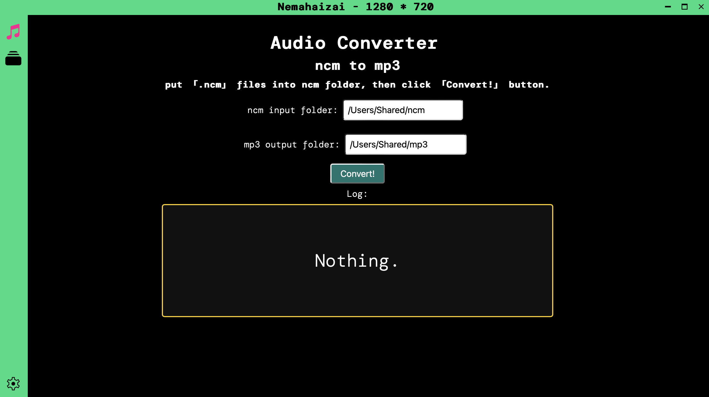
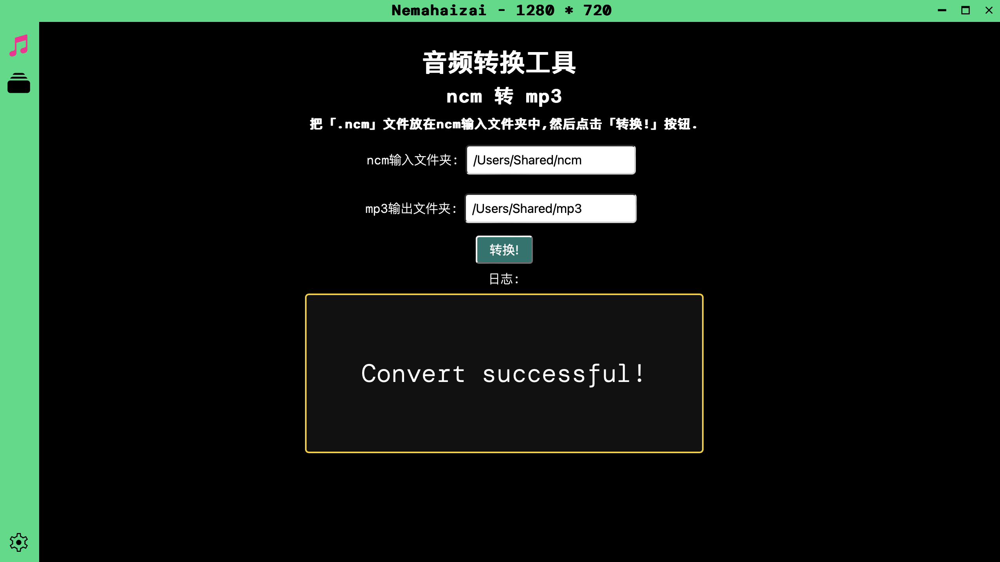

<p align="center">
  
</p>

<h1 align="center">Nemahaizai</h1>

<p align="center">
  Transform netease <b>.ncm</b> audios into <b>mp3</b> and calculate audio BPM.
</p>

# Download pre-released build.

[https://github.com/Vincent-the-gamer/nemahaizai/releases/tag/v0.1.0-pre](https://github.com/Vincent-the-gamer/nemahaizai/releases/tag/v0.1.0-pre)

# Notice
1. This repo will be `merged back` to [Nemassler](https://github.com/Vincent-the-gamer/nemassler).
2. `Merged 「nemassler-rs-core」` on 2024.3.10.

# Dev
## Bump versions of `Cargo.toml`

1. Install `cargo-edit` globally

```shell
cargo install cargo-edit --features vendored-openssl
```

2. Run `cargo upgrade`.

```shell
cargo upgrade
```

P.S. Check your global cargo packs with `cargo install --list`


# Build

## GitHub Actions
Tag required, use

```shell
git tag vX.X.X
```

and CI will trigger on `release` branch push.

## Manual Build
```shell
pnpm tauri build
```

# Early Preview

## English


## Simplified Chinese(partially now.)
